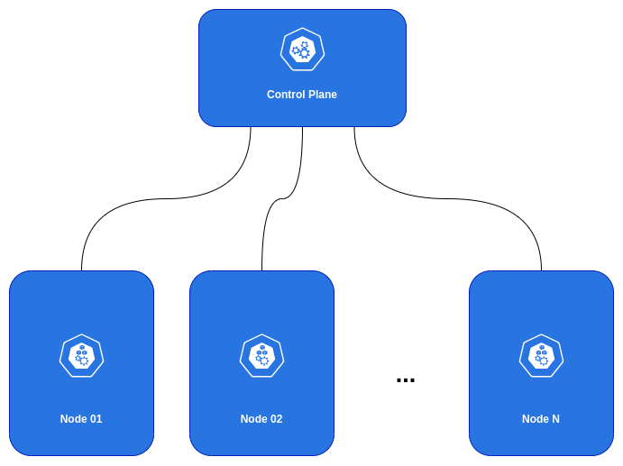

# Kubernetes Cluster (using Vagrant)

# About
This project aims to provide a basic Kubernetes Cluster (for development/study purposes).

# Cluster overview
When you deploy Kubernetes, you get a cluster.

A Kubernetes cluster consists of a set of worker machines, called nodes, that run containerized applications. Every cluster has at least one worker node.

The worker node(s) host the Pods that are the components of the application workload. The control plane manages the worker nodes and the Pods in the cluster. In production environments, the control plane usually runs across multiple computers and a cluster usually runs multiple nodes, providing fault-tolerance and high availability.

<p align="center">

<p/>

# Needed configurations
The latest versions of VirtualBox for UNIX-like systems can cause some network configuration issues. To solve that, edit the `/etc/vbox/networks.conf` file and add:

```
* 0.0.0.0/0 ::/0
```

# Managing cluster VMs

To create/start the cluster VMs, run the command:
```
vagrant up
```

To suspend the cluster VMs, run the command:
```
vagrant halt
```

To destroy the cluster VMs, run the command:
```
vagrant destroy
```